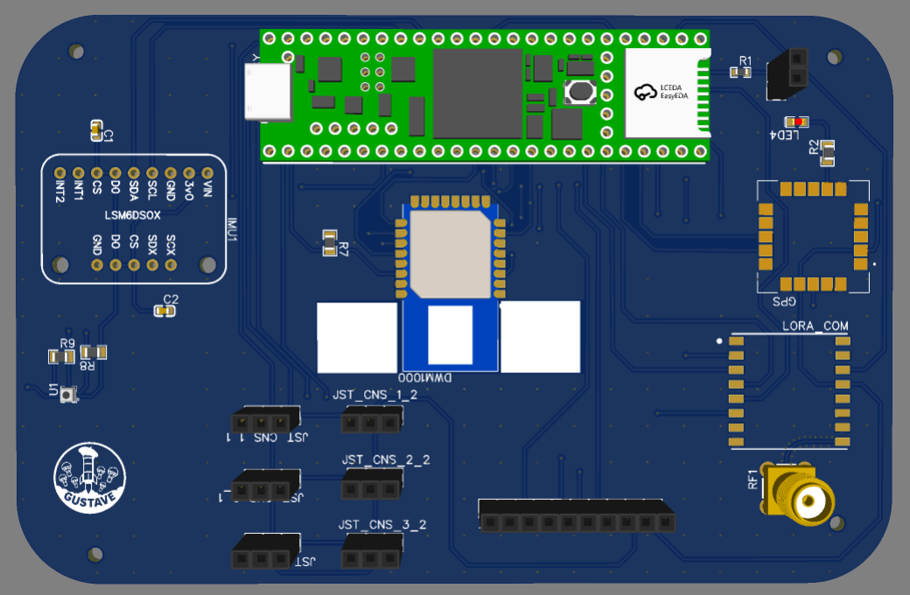

# Gustave Avionics & Telemetry System

Experimental rocket avionics platform developed within AeroIPSA.

<p align="center">
  
</p>

## Overview

Gustave is an experimental rocket developed within AeroIPSA, IPSA's student aerospace association, with a planned launch in March 2027.

The avionics system is responsible for:
- Flight telemetry
- CanSat deployment
- UWB-based positioning between rocket and CanSats logged for post-flight trajectory reconstruction
- Sensor acquisition
- Onboard data logging

## Features

- 4-layer avionics PCB (GND-5V-5V-GND stack up) plus a dedicated PCB for each CanSat
- ARM Cortex-M7 firmware (Teensy 4.1)
- LoRa wireless telemetry
- DW1000 UWB ranging
- GPS positioning
- IMU integration
- Barometric altitude measurement
- SD card data logging
- PWM-based CanSat release at a precise time

### System Architecture & Communication Buses

| Subsystem / Sensor | Interface | Role / Description |
| :--- | :--- | :--- |
| **Teensy 4.1** (ARM Cortex-M7) | — | Main flight computer & data processing |
| **LSM6DSOX** | SPI / I2C | High-rate acceleration & angular velocity tracking |
| **BMP390** | I2C | High-precision barometric altitude estimation |
| **u-blox GNSS** | UART | Absolute positioning & GPS time synchronization |
| **DW1000 UWB** | SPI | High-precision ranging & CanSat relative tracking |
| **LoRa Transceiver** | SPI | Long-range down-link ground telemetry |
| **MicroSD Card** | SDIO / SPI | High-frequency sensor logging & redundancy |
| **CanSat Release** | PWM | Timed pyrotechnic/servo deployment |

## My contributions

### PCB Design

Designed and routed the complete 4-layer avionics PCB for the rocket using EasyEDA, with component choices cross-checked with the team. Also contributed to validating the component selection for the CanSat PCBs, designed by another team member.

### Component Selection & Integration

Contributed to selecting LoRa, DW1000 UWB, GPS, IMU and barometric sensors, validated collectively with the team, for real-time flight telemetry and CanSat localization.

### Embedded Firmware

Developed firmware using the Arduino framework on Teensy 4.1 (ARM Cortex-M7) for both the rocket and CanSat boards, implementing UART, SPI and I2C communication with onboard peripherals and PWM-based CanSat release at a precise time.

### Data Logging

Implemented onboard SD card logging of UWB ranging and sensor data during flight enabling post-flight trajectory reconstruction and fixed a race condition in the logging firmware to ensure data integrity.

### Wireless Communication

Configured the DW1000 UWB ranging link between the rocket and CanSats on Channel 5 (110 kbps, PRF 64 MHz) setting the TX power register per Qorvo/Decawave's manufacturer-certified reference values (Table 20, DW1000 User Manual) to ensure regulatory spectral compliance.

## Technologies

- MCU: Teensy 4.1 (ARM Cortex-M7)
- PCB Design: EasyEDA
- Languages: C, C++
- Framework: Arduino
- Protocols: UART, SPI, I2C, PWM
- Wireless: LoRa, DW1000 UWB
- Sensors: GPS, IMU, Barometric sensor

## Repository Structure
```
Firmware
PCB
Documentation
Images
README.md
```
## Roadmap

- [X] PCB design
- [X] Component selection
- [X] Firmware development
- [X] Sensor integration
- [ ] LoRa range testing (scheduled February)
- [ ] Hardware Validation
- [ ] Flight testing
- [ ] Launch (March 2027)

## License

This repository is intended for portfolio purposes only.


